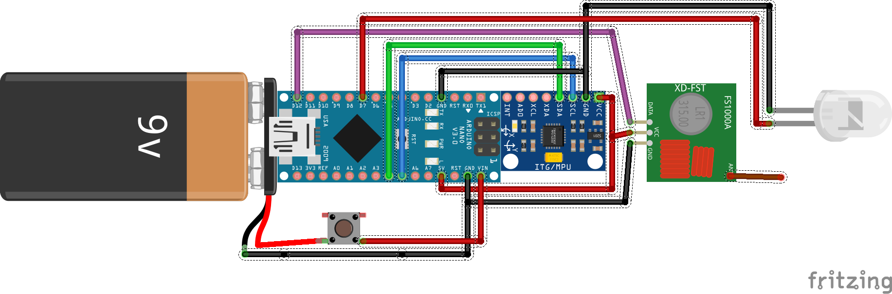
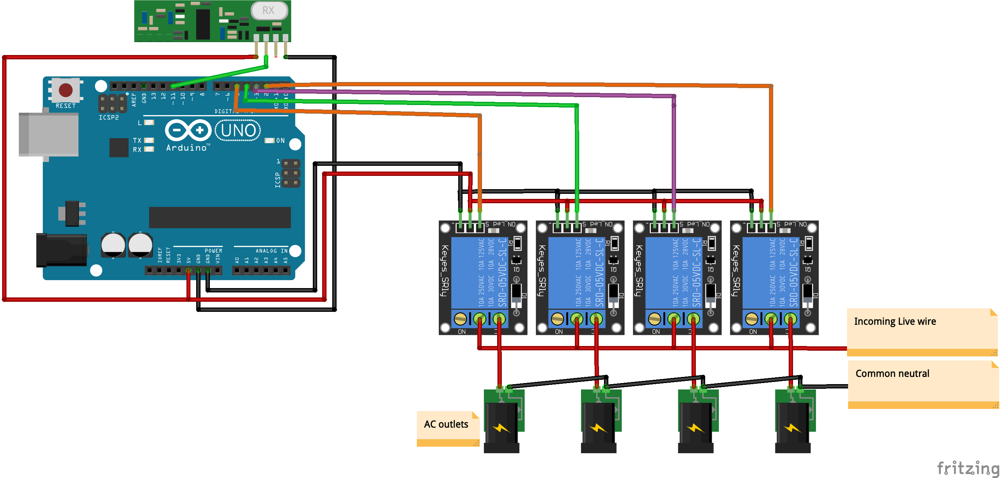

# Magic wand

#### Be like Harry and control anything with your magic wand !

The wand detects when it's being moved around and sends a message to the power bar, which toggles the according outlet (here the "raised" state toggles the lamp on/off).

## The emitter (magic wand)

The wand is an embbeded system composed of :

- an Arduino Nano that controls everything,
- an accelerometer and gyro (MPU 6050),
- a RF 433MHz emitter,
- a 9V battery,
- a LED,
- some magical stuff because it's a magic wand.

Here is an view of the electronic inside the wand :

 

Once initialized (which takes about .8s), the wand continually checks its position. If it detects being raised, lowered, swung left or right, it sends a message to the power bar.

## The receiver (power bar)

The Receiver is a 4 outlets power bar. On top of the traditional wiring for AC, it also includes :

- An Arduino Uno,
- A RF433MHz receiver,
- 4 250V relays

Below is the electronic diagram : 

 

Each relay is connected as follows : 

- Common incoming live wire on C (Common),
- Separate outgoing live wire to the outlet on NC (Normaly Closed)

# Install

The project was made using Platform.io. 
If you are using it too, just open the two folders `emitter` and `receiver` in VSCode, and everything will be done automagically.

If using the Arduino IDE, you will first need to install the `VirtualWire` library.
Then, open the two `src` subfolders in the IDE and you will be able to compile/upload.

# License & Credits

Code and schematics are MIT.

Thx to Tockn for the [MPU6050 library](https://github.com/tockn/MPU6050_tockn). His lib included in this project is slightly tweaked to be faster during initialization, but kudos to him.

And thx to Harry for the idea.